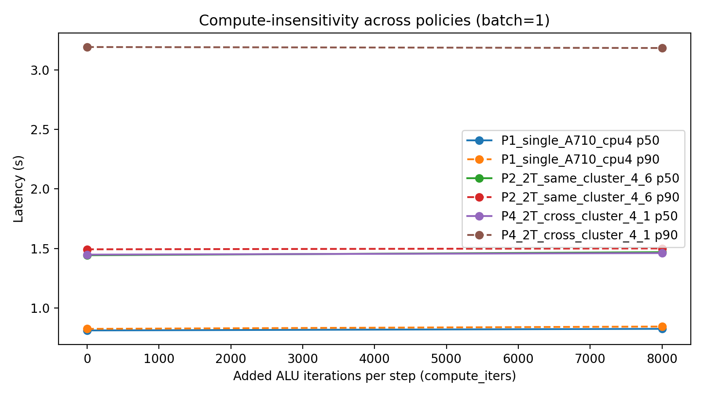
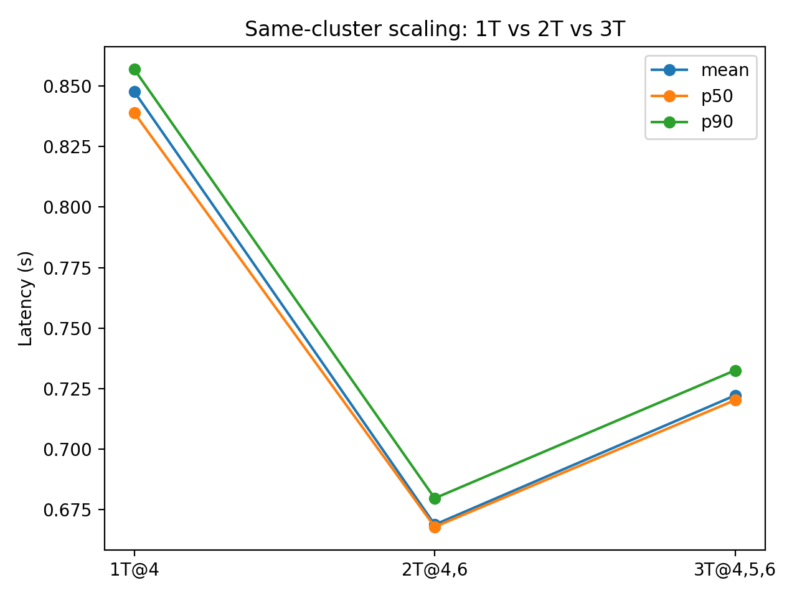
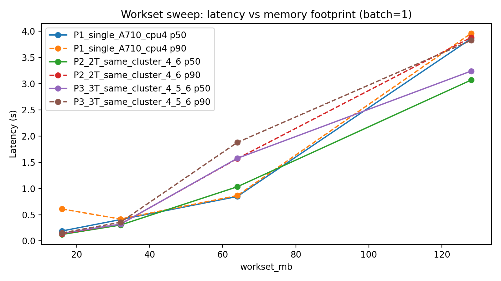
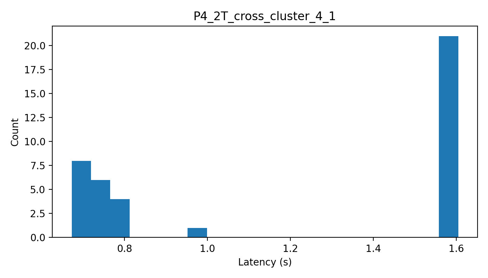
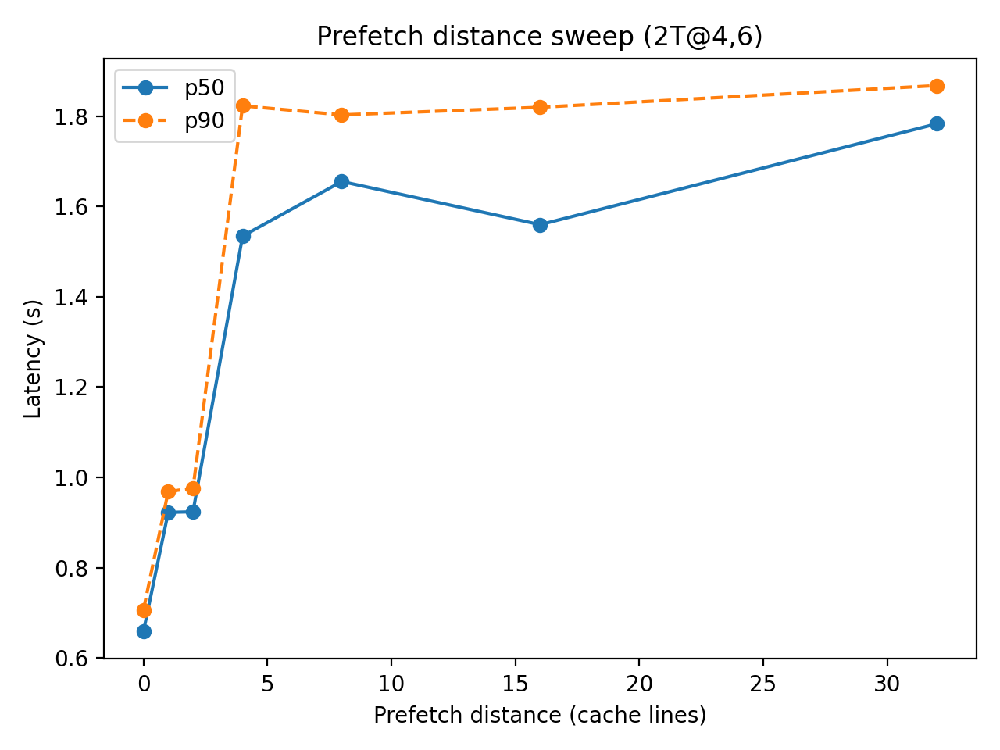
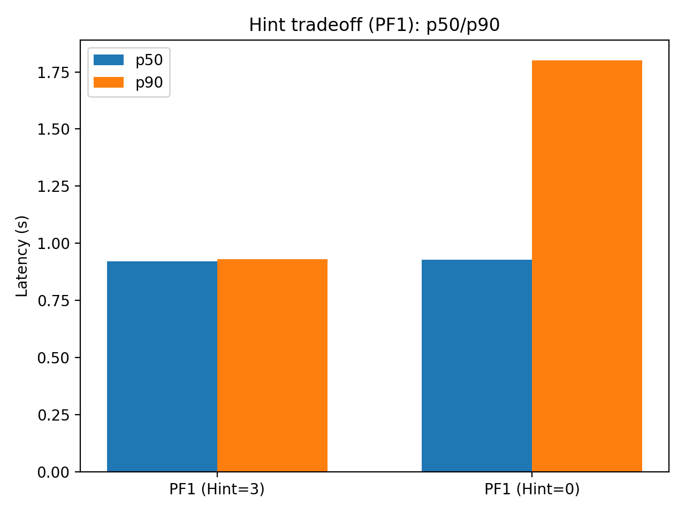

# Topology-aware Bottleneck Diagnosis and Guarded Policy for Mobile LLM Inference

**Abstract**
On-device LLM token generation (batch=1) is highly latency-sensitive but suffers from non-intuitive scaling behaviors on heterogeneous mobile SoCs. We present a reproducible, topology-aware diagnosis methodology on the Dimensity 9000, combining strict per-thread pinning, in-binary perturbations, and a novel **software prefetch knob**.

Our prefetch sweep reveals that increasing in-flight memory requests monotonically degrades latency, contrary to the common "MLP-starved" hypothesis, identifying **shared-resource congestion** (likely L2 miss-handling and interference) as the **most likely bottleneck**. Furthermore, we uncover a **state-dependent tail risk** where low-locality speculation triggers a sharp P90 regression (~1.8s). Based on these findings, we propose a **Guarded Scheduling Policy** that prioritizes 2-thread same-cluster execution (the robust sweet spot) while disabling aggressive memory speculation to **improve SLA robustness**.

---

## 1. Motivation
Interactive mobile LLM inference requires strict tail latency guarantees. However, mobile SoCs introduce complex confounders (e.g., shared cache contention, thermal throttling, heterogeneous cores), making bottleneck diagnosis opaque.
This work targets the **batch=1 token-generation proxy** to answer: **What fundamentally limits low-latency execution, and how can we design a robust OS-level policy to mitigate it?**

---

## 2. Experimental Setup
* **Device:** MediaTek Dimensity 9000 (A510: 0�?, A710: 4�?, X2: 7).
* **Workload:** Batch=1 token-generation proxy, `steps=200`, `workset_mb=64` (default).
* **Methodology:** Strict per-thread `sched_setaffinity` (fail-fast) to eliminate scheduling noise.
* **Knobs:**
    * *Topology:* Same-cluster vs. Cross-cluster.
    * *Compute:* ALU-only perturbation.
    * *MLP:* Software prefetch distance & locality hints.

---

## 3. Diagnosis: Ruling Out Non-Critical Paths
We employ a rigorous causal elimination chain using topology scaling and in-binary perturbations to isolate the bottleneck.

### 3.1 Rule Out: Compute-Bound
Injecting substantial ALU-only work (`compute_iters: 0 �?8000`) yields marginal latency changes across all policies. This confirms the workload is dominated by memory stalls, not arithmetic throughput.

<div align="center">
  
  <br>
  <em>Fig.3. Compute perturbation (ALU-only) has minimal impact on latency across policies.</em>
</div>

### 3.2 Evidence Against: Bandwidth Saturation & Single Global LLC Bottleneck
Two key observations are inconsistent with simple bandwidth saturation or a single dominant LLC (L3) contention model:
1.  **Non-monotonic Scaling:** We observe a sharp regression at 3T (+7.8%) rather than a saturation plateau typical of bandwidth limits.

<div align="center">
  
  <br>
  <em>Fig.1. Same-cluster scaling shows a robust 2T sweet spot (4,6); scaling to 3T regresses (+7.8%).</em>
</div>
<br>

2.  **Ranking Invariance across Footprints:** While absolute latency increases with footprint (16MB to 128MB), the **relative policy ranking (2T > 3T)** remains strictly invariant (see Fig. 4). If the bottleneck were purely global (LLC/L3 capacity or DRAM bandwidth), we would expect the 3T regression gap to narrow, flatten, or shift as the memory subsystem approaches saturation. Instead, the 3T regression persists—even at smaller footprints—suggesting the limiting factor is more likely a cluster-local handling/interference effect (near-core, likely on the L2-side) rather than purely global data movement.

<div align="center">
  
  <br>
  <em>Fig.4. Footprint/workset sweep shifts absolute latency but preserves the relative policy ranking (2T &gt; 3T).</em>
</div>

### 3.3 Cross-Cluster Placement is State-Dependent (Bimodal Latency)
Policy `4,1` (A710+A510) exhibits **bimodal latency** (Fast: 0.72s vs. Slow: 1.59s). This suggests that cross-cluster scheduling introduces **state-dependent instability** (e.g., DVFS/coherence penalties), making it unsuitable for guaranteed SLA.

<div align="center">
  
  <br>
  <em>Fig.2. Cross-cluster policy (4,1) exhibits bimodal latency, indicating state-dependent instability.</em>
</div>

### 3.4 Diagnosis Conclusion: The Memory-Side Dilemma
Having ruled out compute-bound behavior and argued against purely global bottlenecks (DRAM bandwidth / LLC) as the primary limiter, and noting that cross-cluster placement is state-dependent, the bottleneck narrows to a **latency-sensitive memory-side bound**. This leaves two competing hypotheses:

1.  **MLP-Starved:** The system lacks sufficient concurrent memory requests to hide latency.
2.  **Handling/Interference Limited:** The shared near-core resources (e.g.,L2-side miss-handling resources) are saturated, and extra concurrency causes contention.
**We resolve this ambiguity in Section 4.**

---

## 4. Mechanism Analysis: Falsifying "MLP-Starved"
A prevalent hypothesis for memory-bound workloads is "MLP starvation" (insufficient concurrent misses). We rigorously test this by using software prefetch distance as a minimally invasive **MLP knob**.

### 4.1 Monotonic Degradation
Under an **MLP-starved regime**, moderate prefetching is expected to hide latency, yielding a convex (U-shaped) performance curve. However, our sweep (`PF0` to `PF32`) shows **monotonic degradation**:
* **PF1:** Latency degrades by **~40%** immediately compared to baseline (PF0).
* **PF4+:** Latency degrades by **>130%**.

This **argues against the MLP-starved hypothesis**. Instead, it indicates the system operates in a regime **limited by L2 Miss-handling Saturation and Interference**, where any additional memory requests (even gated ones) primarily amplify congestion in the shared near-core memory subsystem.

<div align="center">
  
  <br>
  <em>Fig.5. Prefetch-distance sweep degrades latency monotonically (PF0 �?PF32).</em>
</div>
<br>

### 4.2 Scaling Corroboration
This interpretation is consistent with our topology-aware scaling results (Fig.1): 2T (same-cluster) is the sweet spot, while 3T regresses (+7.8%). Together with the prefetch sweep (Fig.5), this suggests that the system is already near a cluster-local handling/interference limit at 2 threads; adding a 3rd thread—or issuing extra prefetch requests—primarily increases contention rather than improving overlap.


---

## 5. Tail Risk and Policy Guardrails
We further investigate the source of tail latency violations using prefetch locality hints to understand the impact of **L2 interference and pollution**.

### 5.1 The Hint Tradeoff
* **Hint=3 (High Locality):** Latency degrades but remains stable.
* **Hint=0 (Low Locality):** While median latency (P50) is similar to Hint=3, the **P90 tail suffers a severe regression to ~1.8s**.

<div align="center">
  
  <br>
  <em>Fig.6. Low-locality hint keeps median similar but causes a sharp P90 regression (~1.8s).</em>
</div>
<br>

### 5.2 Implication: Why L2 Hygiene Matters
The regression with `hint=0` indicates that **low-locality access patterns cause severe Cache Pollution**, exacerbating interference in the shared L2 subsystem. For an OS-level service, such unpredictability is unacceptable. This validates our policy requirement for **L2 Hygiene**: guardrails must be in place to prevent aggressive or low-locality memory speculation from disrupting the shared handling resources and violating SLA.

---

## 6. Discussion & Policy Implications

### 6.1 Unified Mechanism Model
The evidence supports a **Handling-Saturation Memory Model**:
1.  **Parallelism Benefit:** Scaling from 1T to 2T improves latency by utilizing available L2 bandwidth.
2.  **Saturation Point:** Beyond 2T, the shared L2's **miss-handling resources (e.g. MSHRs)** and **coherence logic** likely become the bottleneck.
3.  **Interference Penalty:** Aggressive speculation (prefetch) or excess threads (3T) exacerbate this bottleneck, leading to degradation.

### 6.2 Guarded Scheduling Policy
We propose a policy for OS-level LLM services:
* **Core Strategy:** Pin execution to **2×A710 same-cluster (CPU4+6)**. This offers the robust sweet spot across 16�?28MB footprints.
* **Guardrails:**
    * **Disable SW Prefetch:** It is detrimental in this latency-limited regime.
    * **Prohibit Cross-Cluster:** To avoid bimodal tail risks.
    * **Enforce L2 Hygiene:** Isolate the cluster from background noise to prevent interference-induced tail regression.

---

## 7. Limitations & Future Work
While our PMU-free causal elimination chain strongly points to L2 handling limits, we acknowledge constraints that open avenues for future research:
* **Observability:** We lack direct hardware counters (PMU) to confirm MSHR occupancy. Future work plans to validate this via controlled interference injection or stride-pattern stress tests.
* **System Noise:** Thermal throttling and background Android services are minimized via pinning, but not strictly eliminated.
* **Generalizability:** Currently limited to Dimensity 9000; verifying the "2-thread sweet spot" on other SoCs (e.g., Snapdragon 8 Gen 3) is a key next step.

**Research direction.** Beyond this case study, we aim to abstract the PMU-free causal elimination chain (topology scaling + in-binary perturbations + minimally invasive MLP knobs) into a **portable black-box diagnosis framework** for mobile SoCs. The longer-term goal is an **OS-level tail-robust scheduling + speculation guardrail methodology** for interactive LLM services, rather than per-SoC manual tuning.

---


## Appendix A: Artifact Evaluation & Reproduction Guide

This artifact provides a **complete, push-button reproduction** of all 6 figures presented in this paper on the MediaTek Dimensity 9000 platform.

### Quick Start

```bash
# From artifact root directory
./reproduce_all_figs.sh
```

**Expected output**: `figs/20_Fig1_*.png` through `figs/25_Fig6_*.png` (6 files total)  
**Estimated time**: 45-60 minutes on Dimensity 9000

---

### Prerequisites

- **Hardware**: MediaTek Dimensity 9000 SoC (tested on OPPO Find X5 Pro, Vivo X80)
- **Software**: Android + Termux, `clang++`, Python 3.7+ with `matplotlib`
- **Setup**: No root required; needs `sched_setaffinity()` syscall access; airplane mode to reduce background noise.

**Installation (Termux)**:
```bash
pkg install clang python
pip install matplotlib
```

---

### Artifact Structure

```
d9000_llm_policy_diag_20260121/
├── 00_snapshot.md              # Quick scan
├── 10_mini_asplos.md           # Full paper
├── 20_table_summary.md         # Quick check data
├── reproduce_all_figs.sh       # Main reproduction script
├── REPRODUCTION.md             # Detailed guide
├── README.md                   # Guider
├── src/                        # C++ workload implementations
├── scripts/                    # Experiment runners
├── analysis/                   # Plotting scripts (Python)
└── results/                    # Generated data (created during run)
    ├── raw/<RUN_ID>/*.csv      # Per-run latency measurements
    ├── tables/*.csv            # Summary statistics (P50/P90)
    └── figs/*.png              # Intermediate plots
```

---

### What Gets Reproduced

| Figure | Claim | Verification Method |
|--------|-------|---------------------|
| **Fig.1** | 2T@(4,6) is the sweet spot | Check `P2 < P1` and `P2 < P3` in summary table |
| **Fig.2** | Cross-cluster shows bimodal latency | Visual inspection: two peaks in histogram |
| **Fig.3** | Workload is compute-insensitive | Lines remain flat from compute_iters 0�?000 |
| **Fig.4** | Policy ranking is workset-invariant | Curves maintain order across 16-128MB |
| **Fig.5** | Prefetch degrades latency monotonically | P50 increases: PF0 < PF1 < ... < PF32 |
| **Fig.6** | Low-locality hint causes P90 spike | `pf1_h0` P90 >> `pf1_h3` P90 (~1.8s) |

**Automated verification**:
```bash
# After running reproduce_all_figs.sh
cat results/tables/summary_20260109_clean_v1.md  # Check sweet spot claim
ls -lh figs/*.png  # Should list 6 PNG files
```

---

### Key Experiments & Data Flow

The reproduction script runs **5 independent experiments**, each generating raw CSV files that are processed into summary tables and then plotted:

#### 1. Topology Scaling (Fig.1-2)
- **Policies**: 1T@4, 2T@(4,6), 3T@(4,5,6), 2T@(4,1)
- **Output**: Demonstrates 2-thread same-cluster sweet spot and cross-cluster bimodality
- **RUN_ID**: `20260109_clean_v1`

#### 2. Compute Perturbation (Fig.3)
- **Knob**: ALU-only iterations (0 �?8000)
- **Output**: Confirms memory-bound (not compute-bound) regime
- **RUN_ID**: `20260109_compute_v2`

#### 3. Workset Sweep (Fig.4)
- **Knob**: Memory footprint (16MB, 32MB, 64MB, 128MB)
- **Output**: Verifies policy ranking invariance across cache pressure levels
- **RUN_IDs**: `20260110_wsweep_v1_ws{16,32,64,128}`

#### 4. Prefetch Distance Sweep (Fig.5)
- **Knob**: Software prefetch distance (0 to 32 cache lines)
- **Output**: Refutes "MLP-starved" hypothesis (latency degrades, not improves)
- **RUN_ID**: `20260118_prefetch_gated_v1`

#### 5. Locality Hint Tradeoff (Fig.6)
- **Knob**: `__builtin_prefetch` locality hint (3 vs. 0)
- **Output**: Demonstrates L2 pollution tail risk with low-locality speculation
- **RUN_ID**: `20260118_prefetch_hint_ab_v1`

Each experiment runs **10 warmup + 40 measured iterations** per policy, with strict per-thread CPU pinning via `sched_setaffinity()` to eliminate scheduling noise.

---

### Troubleshooting

**Issue**: Figures missing or incorrect  
Check intermediate outputs: `ls results/figs/`  
Verify CPU pinning: `grep PIN-OK results/raw/*/*.log`

**Issue**: High latency variance (>30%)  
Enable airplane mode, let device cool, disable background services  
Check thermal throttling: `cat /sys/class/thermal/thermal_zone*/temp`

**Issue**: Script fails partway through  
See `REPRODUCTION.md` for manual step-by-step instructions  
Run individual steps: `bash scripts/run_one_policy.sh <args>`

---

### For Full Details

Consult **`REPRODUCTION.md`** for:
- Complete workflow explanation with data flow diagrams
- Manual reproduction instructions (step-by-step)
- Expected performance numbers (P50/P90 benchmarks)
- Modifying experiments (custom CPU configs, prefetch distances)
- Debugging guide with common failure modes

**Estimated artifact evaluation time**: 1-2 hours (including 45min data collection + validation)

---

### Artifact Checklist

- [ ] All 6 PNG files exist in `figs/` with sizes > 10KB
- [ ] `P2_2T_same_cluster_4_6` has lowest P50 in Fig.1's summary table
- [ ] Fig.2 histogram shows two distinct peaks (bimodal distribution)
- [ ] Fig.3 lines are flat (slope �?0) across compute_iters axis
- [ ] Fig.4 curves maintain ranking (P2 < P1, P2 < P3) across all worksets
- [ ] Fig.5 shows monotonic increase: `P50(PF0) < P50(PF1) < ... < P50(PF32)`
- [ ] Fig.6 bar chart shows `pf1_h0` P90 �?2× higher than `pf1_h3` P90

**Reproducibility standard**: Results should match trends (sweet spot, monotonicity, bimodality) within ±15% absolute latency tolerance due to device-specific thermal/DVFS variations.
